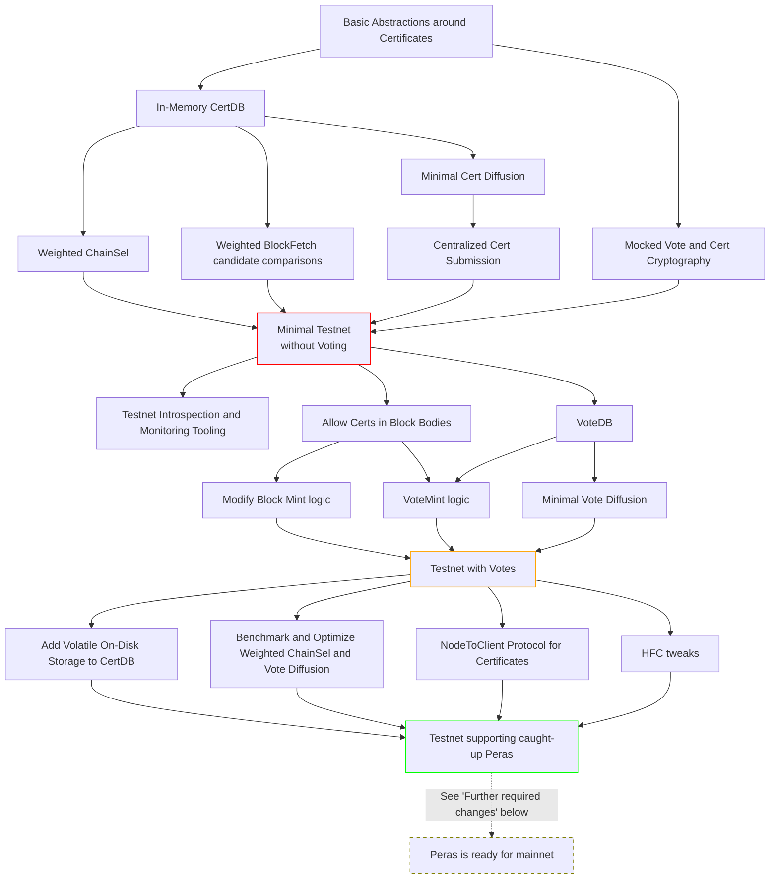

# Draft: Pre-Alpha Peras Implementation Roadmap

This document contains a draft roadmap for implementing pre-alpha Peras in the existing Cardano Haskell, based on the [design and architecture report][report].

## Network and Consensus Implementation (without historical certificates)

First, we describe the Network and Consensus changes, without storing historical certificates (necessary only for syncing via Ouroboros Genesis).

A primary consideration is to iterate around a development testnet for Peras, similar to [SanchoNet](https://sancho.network/), both for testing everything in a real-world environment, as well as allowing interested parties, e.g. stake pool operators and interested users of Peras (e.g. cross-chain apps, L2s, certain dapps), to explore the protocol and its dynamics and guarantees in practice.

### Minimal Testnet without Voting

In this stage, nodes are aware of certificates and act on them appropriately, most notably by selecting the *weightiest* instead of the longest chain. At this stage, the certificates are just "magically" ingested into the system by a centralized entity; no voting is taking place.

This can be seen as an MVP for observing the faster finality properties of Peras on a testnet.

 - First, we need basic abstractions around certificates, such as validating them in the context of a ledger state, as well as efficiently calculating the weight of a chain given a set of certificates from the (in-memory) CertDB.
 - Then, chain comparisons in ChainSel and BlockFetch must be adapted to consider weight.

   For ChainSel, a simple and minimal implementation approach is to essentially re-process the block boosted by the certificate. In the common case, this will not actually cause us to switch to a different chain, which we can detect and handle efficiently.
 - Minimal Cert Diffusion, just enough to support receiving certificates from a centralized certificate submission component.[^min-cert-diff]

[^min-cert-diff]: Note that we could even use a protocol simpler than the suggested object diffusion mini-protocol, but a priori, it doesn't seem difficult to implement this simple functionality there.

During this period, the behavior of Peras can already be tested in a very convenient way, namely by (not) diffusing certificates in a given round completely at will via the centralized component. Of course, care must be taken to only simulate behavior that could actually occur with Peras in practice (e.g. no certificate equivocation).

Note that the work on Cert Diffusion is not wasted even for the purpose of running Peras among caught-up nodes; it is needed both for nodes that were briefly offline as well as for handling vote equivocations.

### Tooling for Introspection and Monitoring

In order to make the effects of Peras visible/introspectable, we need tooling that allows one to make sense of the current state of the system, such as

 - Were the recent rounds successful, i.e. did they gave rise to a quorum? *How* successful were they?
 - What settlement probabilities do recent blocks have, especially compared to Praos?

We anticipate that such tooling, in the form of CLI tools or a simple web page, will be useful both for developers for development, debugging and sanity checking, as well as for third parties exploring Peras and its dynamics. In the long-term, it might turn out to be a useful basis for a mainnet Peras monitoring tool.

Implementation-wise, a simple version of this tool could analyze the trace output of a node, whereas a more elaborate version can have (simple) custom mini-protocol implementations to collect more fine-grained information.

### Testnet with Votes

For this stage, a simple version of the entire Peras voting logic (including proper cooldown handling) is in place.

 - As a basis, we need a simple in-memory VoteDB that stores all votes for the current round.
 - We need a simple implementation of vote diffusion, eg one that does *not* yet try to intelligently distribute the load across its peers.
 - Changes to the block body structure to allow certificates (to signal the end of a cooldown period). This enables changing the Block Mint logic to include certificates in blocks when necessary.
 - The Vote Minting logic (ran at the beginning of every round), which, when successful, adds a vote to the VoteDB for outbound diffusion.

### Testnet supporting caught-up Peras

At this stage, everything necessary to run pre-alpha Peras among caught-up nodes has been implemented, enabling large-scale testing and early integration with potential applications.

Mostly, this consists of optimizations:

 - Vote Diffusion is optimized, in particular to avoid downloading the same vote repeatedly from different peers. This bears similarities to work by the IOG Network team on their more efficient governor-based TxSubmission logic, cf. https://github.com/IntersectMBO/ouroboros-network/pull/4887.
 - Weighted ChainSel is benchmarked to determine whether a more efficient implementation (with intermediate caching of candidates) is due.
 - Certificates boosting volatile blocks are stored on disk, in order to avoid re-downloading them upon restart.

Additionally, some changes to the Hard Fork Combinator are required (see section 2.7 in the [report][]).

Finally, there now is a NodeToClient protocol for certificates (see section 2.11.1 in the [report][]) as well as appropriate guidance on how to consume this for downstream applications.

## Further required changes

Apart from the changes to the Network and Consensus layer described above, the following aspects need to be implemented; but they are not blocking the work described above.

### Using actual cryptography

Of course, we can not actually ship Peras with mock crypto with artificially-sized votes and certificates. We need to first make the final decision on a particular cryptographic scheme (see Appendix B in the [report][] for an overview and candidates), which requires interactions with the Leios and Mithril workstreams to ensure alignment. Then, the scheme needs to be implemented, tested and audited, and finally plugged into the crypto abstraction.

Most likely, this will also require changes to the KES agent, see section 2.11.4 in the [report][].

### Ledger changes

The ledger needs to add the new Peras-related protocol parameters, and needs to enrich pool registration certificates to allow pool operators to register the new Peras-specific keys.

In particular, an intra-era hard fork enabling the Peras key registration period (section 2.11.3 in the [report][]) needs to be added.

### Storing historical certificates

Due to the "duty to remember" certificates, this requires long-term disk storage for old certificates, as well as a mechanism to ensure that we actually download all certificates while syncing as described in the [report][].

A related idea is to implement more efficient syncing by using block *re*application instead of full application as described in section 2.11.2.

[report]: https://tweag.github.io/cardano-peras/peras-design.pdf
