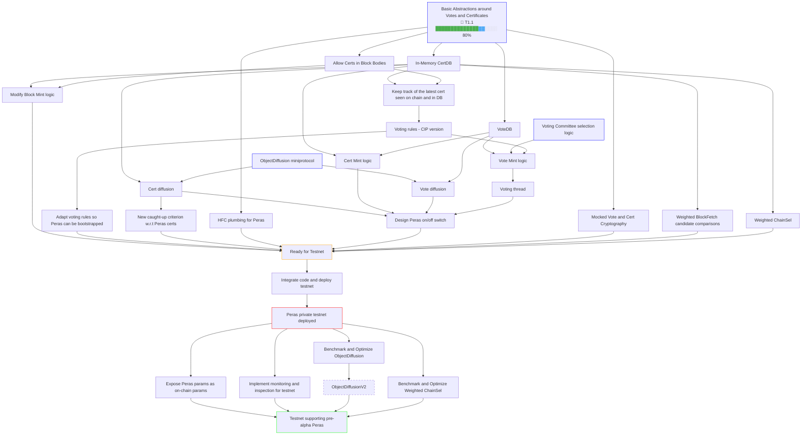

```mermaid
graph TD
  BasicAbstr["Basic Abstractions around Votes and Certificates<br/>🎯 T1.1<br/><span style="color:#4caf50">██████████████</span><span style="color:#2196f3">▓▓</span><span style="color:#ccc">░░░░</span> 80%"]
  style BasicAbstr stroke:blue

  ObjectDiffusion["ObjectDiffusion miniprotocol"]
  style ObjectDiffusion stroke:blue

  VotingCommittee["Voting Committee selection logic"]
  style VotingCommittee stroke:blue

  CertDB["In-Memory CertDB"]
  BasicAbstr --> CertDB

  CertsInBlocks["Allow Certs in Block Bodies"]
  BasicAbstr --> CertsInBlocks

  HFCPlumbing["HFC plumbing for Peras"]
  BasicAbstr --> HFCPlumbing

  MockedCrypto["Mocked Vote and Cert Cryptography"]
  BasicAbstr --> MockedCrypto

  VoteDB["VoteDB"]
  BasicAbstr --> VoteDB

  WeightedBlockFetch["Weighted BlockFetch candidate comparisons"]
  CertDB --> WeightedBlockFetch

  WeightedChainSel["Weighted ChainSel"]
  CertDB --> WeightedChainSel

  BlockMint["Modify Block Mint logic"]
  CertDB --> BlockMint
  CertsInBlocks --> BlockMint

  KeepTrackLastCert["Keep track of the latest cert seen on chain and in DB"]
  CertDB --> KeepTrackLastCert
  CertsInBlocks --> KeepTrackLastCert

  VotingRules["Voting rules - CIP version"]
  KeepTrackLastCert --> VotingRules

  CertDiffusion["Cert diffusion"]
  CertDB --> CertDiffusion
  ObjectDiffusion --> CertDiffusion

  CaughtUpCriterion["New caught-up criterion w.r.t Peras certs"]
  CertDiffusion --> CaughtUpCriterion

  CertMint["Cert Mint logic"]
  CertDB --> CertMint
  VoteDB --> CertMint

  VoteDiffusion["Vote diffusion"]
  ObjectDiffusion --> VoteDiffusion
  VoteDB --> VoteDiffusion

  Bootstrap["Adapt voting rules so Peras can be bootstrapped"]
  VotingRules --> Bootstrap

  VoteMint["Vote Mint logic"]
  VoteDB --> VoteMint
  VotingCommittee --> VoteMint
  VotingRules --> VoteMint

  VotingThread["Voting thread"]
  VoteMint --> VotingThread

  KillSwitch["Design Peras on/off switch"]
  CertDiffusion --> KillSwitch
  CertMint --> KillSwitch
  VoteDiffusion --> KillSwitch
  VotingThread --> KillSwitch

  ReadyForTestnet["Ready for Testnet"]
  style ReadyForTestnet stroke:orange
  BlockMint --> ReadyForTestnet
  Bootstrap --> ReadyForTestnet
  CaughtUpCriterion --> ReadyForTestnet
  HFCPlumbing --> ReadyForTestnet
  KillSwitch --> ReadyForTestnet
  MockedCrypto --> ReadyForTestnet
  WeightedBlockFetch --> ReadyForTestnet
  WeightedChainSel --> ReadyForTestnet

  Deploy["Integrate code and deploy testnet"]
  ReadyForTestnet --> Deploy

  Testnet["Peras private testnet deployed"]
  style Testnet stroke:red
  Deploy --> Testnet

  ExposeParams["Expose Peras params as on-chain params"]
  Testnet --> ExposeParams

  Monitoring["Implement monitoring and inspection for testnet"]
  Testnet --> Monitoring

  OptimizeObjectDiffusion["Benchmark and Optimize ObjectDiffusion"]
  Testnet --> OptimizeObjectDiffusion

  OptimizeWeightedSel["Benchmark and Optimize Weighted ChainSel"]
  Testnet --> OptimizeWeightedSel

  ObjectDiffusionV2["ObjectDiffusionV2"]
  style ObjectDiffusionV2 stroke-dasharray:5
  OptimizeObjectDiffusion --> ObjectDiffusionV2

  TestnetCaughtUp["Testnet supporting pre-alpha Peras"]
  style TestnetCaughtUp stroke:lime
  ExposeParams --> TestnetCaughtUp
  Monitoring --> TestnetCaughtUp
  ObjectDiffusionV2 --> TestnetCaughtUp
  OptimizeWeightedSel --> TestnetCaughtUp

```
