```mermaid
graph TD
  BasicAbstr["Basic Abstractions around Votes and Certificates<br/><span style="color:#4caf50">████████████████████</span> 100%"]
  style BasicAbstr stroke:red

  ObjectDiffusion["ObjectDiffusion miniprotocol<br/><span style="color:#4caf50">██████████</span><span style="color:#ccc">░░░░░░░░░░</span> 50%"]
  style ObjectDiffusion stroke:green

  VotingCommittee["Voting Committee selection logic<br/><span style="color:#4caf50">████</span><span style="color:#ccc">░░░░░░░░░░░░░░░░</span> 20%"]
  style VotingCommittee stroke:blue

  Dashboard["Design dashboard to preview Peras costs and guarantees<br/><span style="color:#4caf50">████████████</span><span style="color:#ccc">░░░░░░░░</span> 60%"]
  style Dashboard stroke:orange

  CertDB["In-Memory CertDB<br/><span style="color:#4caf50">██████████</span><span style="color:#ccc">░░░░░░░░░░</span> 50%"]
  style CertDB stroke:green
  BasicAbstr --> CertDB

  CertsInBlocks["Allow Certs in Block Bodies<br/><span style="color:#4caf50">██████</span><span style="color:#ccc">░░░░░░░░░░░░░░</span> 30%"]
  style CertsInBlocks stroke:blue
  BasicAbstr --> CertsInBlocks

  DeployDashboard["Deploy dashboard on a public-facing website<br/><span style="color:#ccc">░░░░░░░░░░░░░░░░░░░░</span> 0%"]
  style DeployDashboard stroke:orange
  Dashboard --> DeployDashboard

  HFCPlumbing["HFC plumbing for Peras<br/><span style="color:#4caf50">██████</span><span style="color:#ccc">░░░░░░░░░░░░░░</span> 30%"]
  style HFCPlumbing stroke:blue
  BasicAbstr --> HFCPlumbing

  MockedCrypto["Mocked Vote and Cert Cryptography<br/><span style="color:#4caf50">██████</span><span style="color:#ccc">░░░░░░░░░░░░░░</span> 30%"]
  style MockedCrypto stroke:blue
  BasicAbstr --> MockedCrypto

  VoteDB["VoteDB<br/><span style="color:#4caf50">██████████████████</span><span style="color:#ccc">░░</span> 90%"]
  style VoteDB stroke:green
  BasicAbstr --> VoteDB

  WeightedBlockFetch["Weighted BlockFetch candidate comparisons<br/><span style="color:#4caf50">████████████████████</span> 100%"]
  style WeightedBlockFetch stroke:yellow
  CertDB --> WeightedBlockFetch

  WeightedChainSel["Weighted ChainSel<br/><span style="color:#4caf50">████████████████████</span> 100%"]
  style WeightedChainSel stroke:yellow
  CertDB --> WeightedChainSel

  BlockMint["Modify Block Mint logic<br/><span style="color:#ccc">░░░░░░░░░░░░░░░░░░░░</span> 0%"]
  style BlockMint stroke:blue
  CertDB --> BlockMint
  CertsInBlocks --> BlockMint

  KeepTrackLastCert["Keep track of the latest cert seen on chain and in DB<br/><span style="color:#4caf50">████████████████</span><span style="color:#ccc">░░░░</span> 80%"]
  style KeepTrackLastCert stroke:blue
  CertDB --> KeepTrackLastCert
  CertsInBlocks --> KeepTrackLastCert

  VotingRules["Voting rules - CIP version<br/><span style="color:#4caf50">████████████████████</span> 100%"]
  style VotingRules stroke:red
  KeepTrackLastCert --> VotingRules

  CertDiffusion["Cert diffusion<br/><span style="color:#4caf50">████████████████</span><span style="color:#ccc">░░░░</span> 80%"]
  style CertDiffusion stroke:green
  CertDB --> CertDiffusion
  ObjectDiffusion --> CertDiffusion

  CaughtUpCriterion["New caught-up criterion w.r.t Peras certs<br/><span style="color:#4caf50">████</span><span style="color:#ccc">░░░░░░░░░░░░░░░░</span> 20%"]
  style CaughtUpCriterion stroke:blue
  CertDiffusion --> CaughtUpCriterion

  CertMint["Cert Mint logic<br/><span style="color:#4caf50">██████████████████</span><span style="color:#ccc">░░</span> 90%"]
  style CertMint stroke:blue
  CertDB --> CertMint
  VoteDB --> CertMint

  VoteDiffusion["Vote diffusion<br/><span style="color:#4caf50">████████████████</span><span style="color:#ccc">░░░░</span> 80%"]
  style VoteDiffusion stroke:green
  ObjectDiffusion --> VoteDiffusion
  VoteDB --> VoteDiffusion

  Bootstrap["Adapt voting rules so Peras can be bootstrapped<br/><span style="color:#4caf50">████████████</span><span style="color:#ccc">░░░░░░░░</span> 60%"]
  style Bootstrap stroke:blue
  VotingRules --> Bootstrap

  VoteMint["Vote Mint logic<br/><span style="color:#ccc">░░░░░░░░░░░░░░░░░░░░</span> 0%"]
  style VoteMint stroke:blue
  VoteDB --> VoteMint
  VotingCommittee --> VoteMint
  VotingRules --> VoteMint

  VotingThread["Voting thread<br/><span style="color:#ccc">░░░░░░░░░░░░░░░░░░░░</span> 0%"]
  style VotingThread stroke:blue
  VoteMint --> VotingThread

  KillSwitch["Design Peras on/off switch<br/><span style="color:#ccc">░░░░░░░░░░░░░░░░░░░░</span> 0%"]
  style KillSwitch stroke:blue
  CertDiffusion --> KillSwitch
  CertMint --> KillSwitch
  VoteDiffusion --> KillSwitch
  VotingThread --> KillSwitch

  ReadyForTestnet["Ready for Testnet"]
  style ReadyForTestnet stroke:blue
  BlockMint --> ReadyForTestnet
  Bootstrap --> ReadyForTestnet
  CaughtUpCriterion --> ReadyForTestnet
  HFCPlumbing --> ReadyForTestnet
  KillSwitch --> ReadyForTestnet
  MockedCrypto --> ReadyForTestnet
  WeightedBlockFetch --> ReadyForTestnet
  WeightedChainSel --> ReadyForTestnet

  Deploy["Integrate code and deploy testnet"]
  style Deploy stroke:blue
  ReadyForTestnet --> Deploy

  Testnet["Peras private testnet deployed"]
  style Testnet stroke:blue
  Deploy --> Testnet

  ExposeParams["Expose Peras params as on-chain params"]
  style ExposeParams stroke:purple,stroke-dasharray:5
  Testnet --> ExposeParams

  Monitoring["Implement monitoring and inspection for testnet"]
  style Monitoring stroke:purple
  Testnet --> Monitoring

  OptimizeObjectDiffusion["Benchmark and Optimize ObjectDiffusion"]
  style OptimizeObjectDiffusion stroke:purple
  Testnet --> OptimizeObjectDiffusion

  OptimizeWeightedSel["Benchmark and Optimize Weighted ChainSel"]
  style OptimizeWeightedSel stroke:purple
  Testnet --> OptimizeWeightedSel

  ObjectDiffusionV2["ObjectDiffusionV2<br/><span style="color:#4caf50">██████████</span><span style="color:#ccc">░░░░░░░░░░</span> 50%"]
  style ObjectDiffusionV2 stroke:purple,stroke-dasharray:5
  OptimizeObjectDiffusion --> ObjectDiffusionV2

  TestnetCaughtUp["Testnet supporting pre-alpha Peras"]
  style TestnetCaughtUp stroke:purple
  ExposeParams --> TestnetCaughtUp
  Monitoring --> TestnetCaughtUp
  ObjectDiffusionV2 --> TestnetCaughtUp
  OptimizeWeightedSel --> TestnetCaughtUp

```

**Color legend**:

- red: T1.1 milestone
- orange: T1.2 milestone
- yellow: T1.3 milestone
- green: T1.4 milestone
- blue: T1.5 milestone
- purple: T1.6 milestone

**Progress legend**:

- 0-60%: internal progress on the feature. 50% means mostly done, 60% means that the code in satisfying state for the person in charge of the feature
- 70%: feature has been reviewed internally, up for external review
- 80%: feature has been reviewed once externally
- 90%: feature has been reviewed twice externally, pending final edits
- 100%: feature is complete and merged
